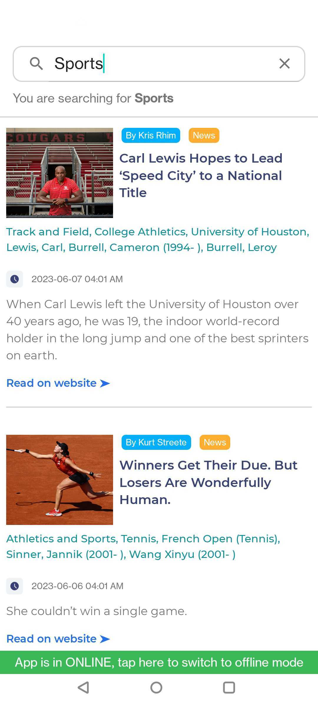
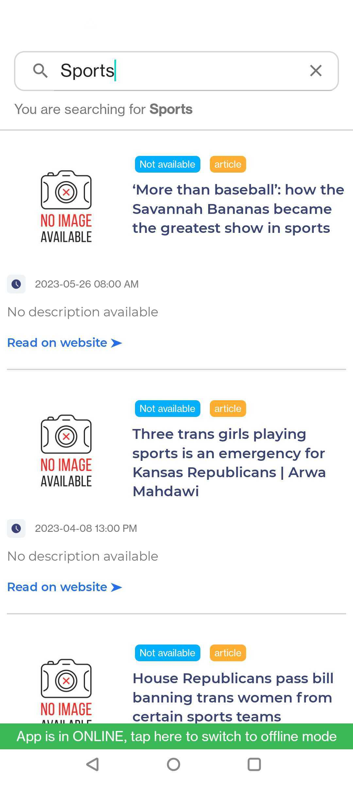
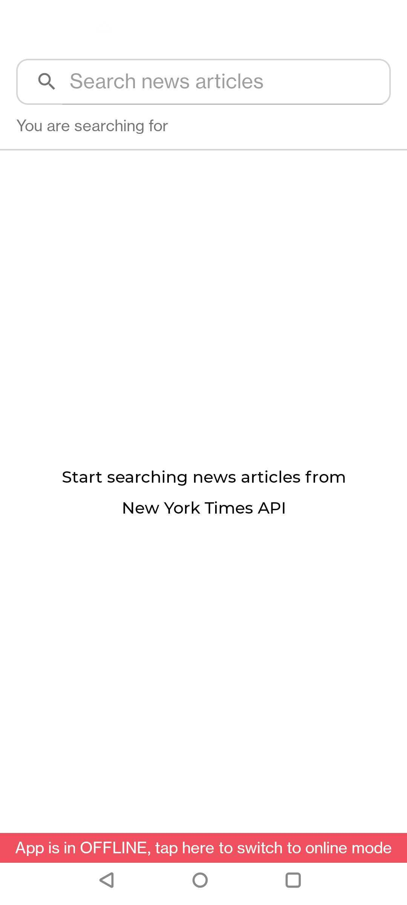
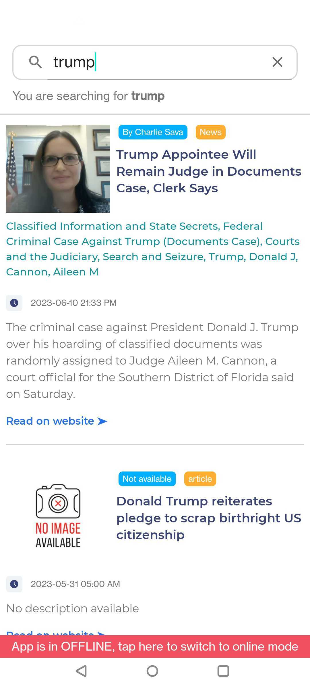
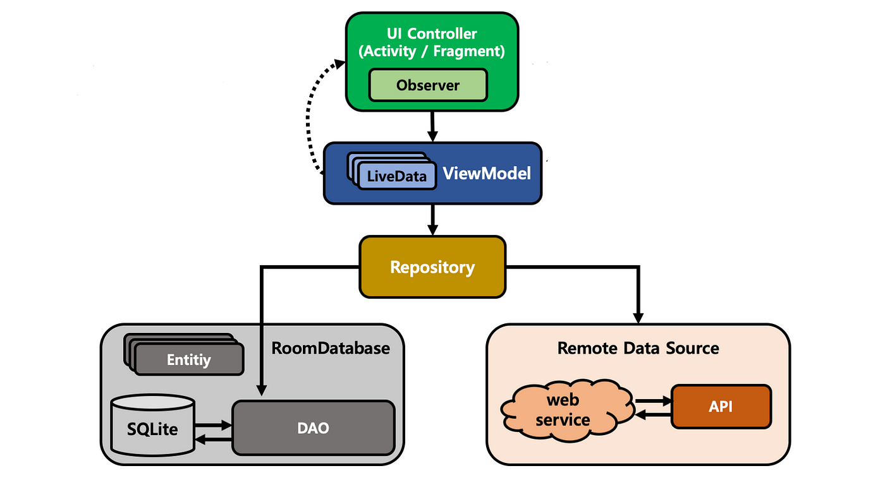

<h1 align="center">Newsify 🦉 </h1>

  
<b>Newsify</b> is a news searching android app 📱 built using latest android technologies in market

 

## Download from drive link to test

## Screenshots
   

## About
Newsify provides you space to search about latest topics and queries from the popular API's - New York Times and Guardian API. News articles will be always loaded
from the local database. Remote data from the API and the local data in the database are always synchronized.
- Nesify support **pagination**, serves the data as and when required.
- Newsify supports **offline mode** as well making reading news habits seamless even when you have limited internet connection.
- API's used are [New York Times](https://developer.nytimes.com/apis) and [The Guardian](https://open-platform.theguardian.com/)

## Built with 🛠
- [Kotlin](https://kotlinlang.org/) - Official programming language for Android development.
- [Coroutines](https://kotlinlang.org/docs/reference/coroutines-overview.html) - For asynchronous and more..
- [Android Architecture Components](https://developer.android.com/topic/libraries/architecture) - Collection of libraries that help you design robust, testable, and maintainable apps.
  - [LiveData](https://developer.android.com/topic/libraries/architecture/livedata) - Data objects that notify views when the underlying database changes.
  - [ViewModel](https://developer.android.com/topic/libraries/architecture/viewmodel) - Stores UI-related data that isn't destroyed on UI changes. 
  - [ViewBinding](https://developer.android.com/topic/libraries/view-binding) - Generates a binding class for each XML layout file present in that module and allows you to more easily write code that interacts with views.
  - [Room](https://developer.android.com/topic/libraries/architecture/room) - SQLite object mapping library.
  - [Retrofit](https://square.github.io/retrofit/) - A type-safe HTTP client for Android and Java.
- [Gson](https://github.com/google/gson) - Java library that can be used to convert Java Objects into their JSON representation and vice-versa.

## Architecture
This app uses [***MVVM (Model View View-Model)***](https://developer.android.com/jetpack/docs/guide#recommended-app-arch) architecture.

## Upcoming features
- Login and signup
- Home feed with trending topics, etc
- Material UI with dark theme support. 🌗
- and a lot more..
